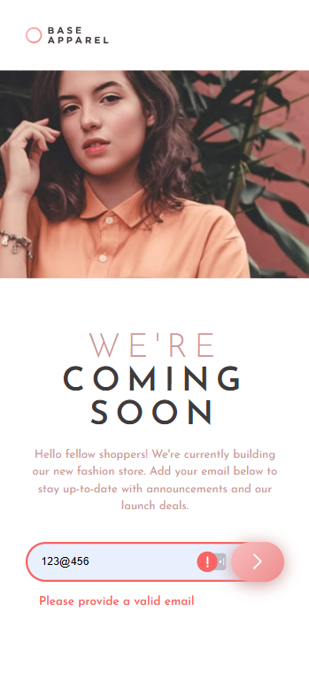
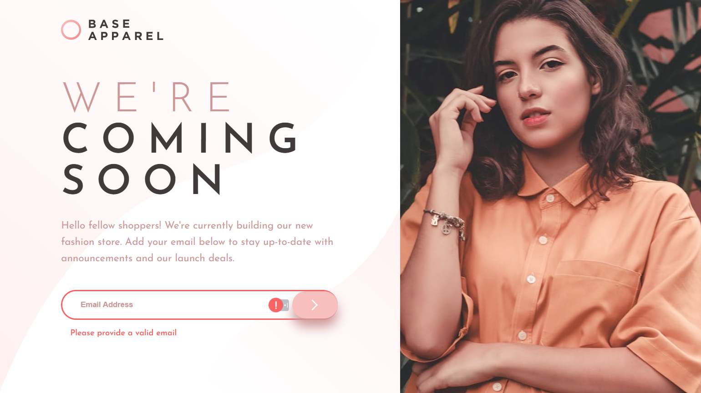

# Frontend Mentor - Base Apparel coming soon page solution

Esta es una solución al reto [Base Apparel coming soon page challenge on Frontend Mentor](https://www.frontendmentor.io/challenges/base-apparel-coming-soon-page-5d46b47f8db8a7063f9331a0). Los retos de Frontend Mentor ayudan a mejorar tus habilidades de desarrollo construyendo proyectos reales.

## Tabla de contenidos

- [Resumen](#resumen)
  - [El reto](#el-reto)
  - [Descripción](#descripción)
  - [Captura de pantalla](#captura-de-pantalla)
  - [Enlaces](#enlaces)
- [Mi proceso](#mi-proceso)
  - [Tecnologías utilizadas](#tecnologías-utilizadas)
  - [Lo que aprendí](#lo-que-aprendí)
  - [Recursos útiles](#recursos-útiles)
- [Autor](#autor)
- [Agradecimientos](#agradecimientos)

## Resumen

### El reto

Los usuarios deben poder:

- Ver el diseño óptimo del sitio según el tamaño de la pantalla de su dispositivo
- Ver los estados al pasar el cursor sobre todos los elementos interactivos de la página
- Recibir un mensaje de error al enviar el formulario si:
- El campo de entrada está vacío
- La dirección de correo electrónico no tiene el formato correcto

### Descripción
El proyecto consiste en una landing page responsiva que anuncia la próxima apertura de una tienda de moda. Incluye un formulario para suscribirse con el correo electrónico y recibir novedades sobre el lanzamiento.

### Captura de pantalla




### Enlaces

- URL de la solución: [GitHub](https://github.com/marco-moya/Base-Apparel-coming-soon-page)
- URL del sitio en vivo: [GitHub Pages](https://marco-moya.github.io/Base-Apparel-coming-soon-page)

## Mi proceso

### Tecnologías utilizadas

- HTML5 semántico
- Propiedades personalizadas de CSS
- Flexbox
- CSS Grid
- Flujo mobile-first
- JavaScript
- [Google Fonts: Josefin Sans](https://fonts.google.com/specimen/Josefin+Sans)

### Proceso

- Se creó la estructura HTML siguiendo el diseño proporcionado.
- Se aplicaron estilos CSS, utilizando gradientes para el botón y adaptando el diseño a dispositivos móviles y escritorio.
- Se implementó la validación del formulario en JavaScript usando expresiones regulares para verificar el formato del correo electrónico.
- Se añadieron mensajes y estilos de error para mejorar la experiencia de usuario.

### Lo que aprendí

- Cómo aplicar gradientes en CSS para crear fondos atractivos y modernos.
- Uso de expresiones regulares en JavaScript para validar correos electrónicos de manera eficiente.
- Integración de imágenes adaptativas usando la etiqueta `<picture>`.

Ejemplo de código que destaco:

```css
<picture>
  <source media="(min-width: 64rem)" srcset="./images/hero-desktop.jpg">
  
</picture>
```
### Recursos útiles

- [Guía de CSS Grid](https://css-tricks.com/snippets/css/complete-guide-grid/)
- [Documentación de Flexbox](https://css-tricks.com/snippets/css/a-guide-to-flexbox/)
- [Documentación de gradientes en CSS](https://developer.mozilla.org/es/docs/Web/CSS/gradient)
- [Expresiones regulares en JavaScript](https://developer.mozilla.org/es/docs/Web/JavaScript/Guide/Regular_expressions)

## Autor

- Frontend Mentor - [@marco-moya](https://www.frontendmentor.io/profile/marco-moya)

## Agradecimientos

Gracias a Frontend Mentor por los retos y a la comunidad por la inspiración y feedback.
